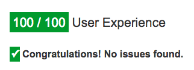

layout: true
class: center, middle, inverse
---
#Beezwax.net 3.0
---
~520 git commits later...

#We've launched!
---
# Big thanks to everyone who helped!

 

 

Also Julian, Jay, Luke and anyone I may have forgotten
---
layout: false

# Project goals

* Catch up with latest web technologies
* Modern look
* Mobile support
* Improved load speeds
* SEO
---
layout: false

# Where we're at

## Full mobile support

Mobile score on Google PageSpeed
---
class: left, inverse
# Where we're at

---
class: left, inverse
# The road ahead...

* Single sign on
* Search
* Improved blog
